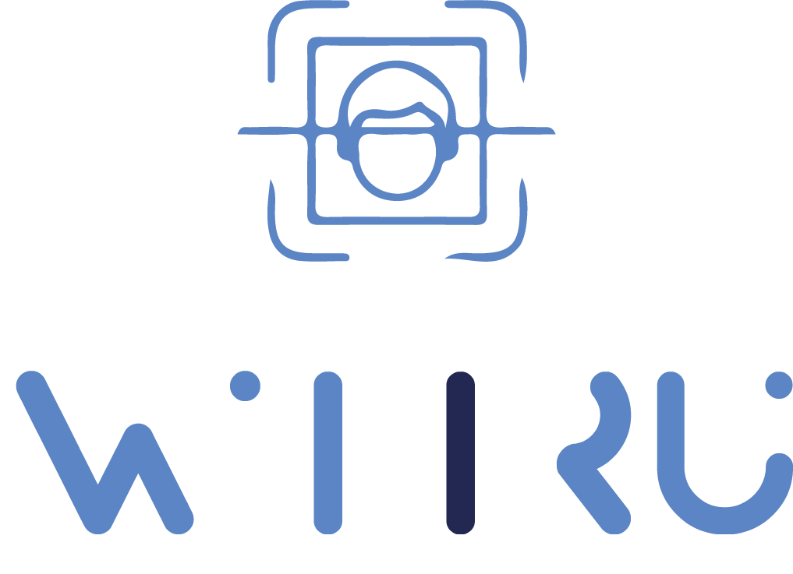

  
# ATUT24-DataScience-G1-SimFace 

 ____________________________

<h1 align="center">
    <a href="http://962e0c7d-3425-4e8e-b23a-5da4e71aea27.pub.instances.scw.cloud:5001/">
    
</h1>


# wiiru: face recognition website.

Imagine a world where your identity is protected in the blink of an eye. A world where administrative procedures are simplified thanks to technology. This is the promise of Wiirù.q

## Deployed link

```bash
http://962e0c7d-3425-4e8e-b23a-5da4e71aea27.pub.instances.scw.cloud:5001/


```

## Run the project locally 

 ```bash
   git clone git@github.com:iSheero-AI/ATUT24-DataScience-G1-SimFace.git
 ```


<br>

 ```bash
  cd frontend
 ```


## Frontend

This a vue js project using componenes and tailwind css

### Pages

 - Home
 - Compare two images Page
 - Get data from an image Page

## Recommended IDE Setup

[VSCode](https://code.visualstudio.com/) + [Volar](https://marketplace.visualstudio.com/items?itemName=Vue.volar) (and disable Vetur).

## Customize configuration

See [Vite Configuration Reference](https://vitejs.dev/config/).

## Project Setup

```sh
npm install
```

### Compile and Hot-Reload for Development

```sh
npm run dev
```

### Compile and Minify for Production

```sh
npm run build
```

### Run Unit Tests with [Vitest](https://vitest.dev/)

```sh
npm run test:unit
```
### Lint with [ESLint](https://eslint.org/)

```sh
npm run lint
```

## Installation info

### Vue [Documentation](https://vuejs.org/guide/introduction.html)

### Documentation to install [Tailwind](https://v2.tailwindcss.com/docs/guides/vue-3-vite)

## Backend


# FLASK API
## Description

This is a Flask Restful API application designed to manage requests to Deepface Deepl Learning model, and provide response to frontend application. This README provides instructions for setting up the application, running it locally.

## Features

- Route compare to compare two images
- Route comparedata to find an image in images database

## Prerequisites

Before you begin, ensure you have met the following requirements:

- Python 3.x installed on your machine
- Flask, Deepface and other dependencies listed in requirements.txt

## Installation

Follow these steps to set up the application on your local machine:

1. *change directory*
```sh
cd backend
```
   

2. *Create a virtual environment:*

```sh
python3 -m venv virtual_env_name
source virtual_env_name/bin/activate  
   # On Windows use `virtual_env_name\Scripts\activate`
```

3. *Install the required packages:*

```sh
pip install -r requirements.txt  
```

or 

```sh
cd deepface
pip install -e .
```

## Usage

To run the application locally:

```sh
flask run
```


## Credits

#### Creation's team

## Integration Web Dev and Dockerisation 
<a href="mailto:alex-russel.kouawou@epitech.eu">Alex-Russel Kouawou</a>
<br />
<a href="mailto:stella.aguemon@epitech.eu">Stella aguemon</a>
<br />

## Developing the model 
<a href="atignonanna@gmail.com">Anne-Marie Atignon</a>
<br />
<a href="pinelbaudelaire@gmail.com">DAHOUI Pinel Baudelaire T</a>
<br />
<a href="ahouanganmichael@gmail.com">AHOUANGAN Mickaël Julus Jésugnon</a>
<br />
<a href="gracemania74@gmail.com">ATTAGLO K. Amenuvé </a>
<br />
<a href="otinielgodwinaguida@gmail.com">Otiniel AGUIDA</a>
<br />
<a href="daoudaabassichristian@gmail.com">DAOUDA  ABASSI Christian</a>
<br />
<a href="mahuvivituribiok@gmail.com">Mahuvivi Turibio KEKE</a>

## Deploying the website and the model
<a href="abrahamkoloboe2000@gmail.com">Abraham KOLOBOE</a>


#### Africa Tech Up Tour (ATUT)
#### ISHEERO
#### RINTIO
####
